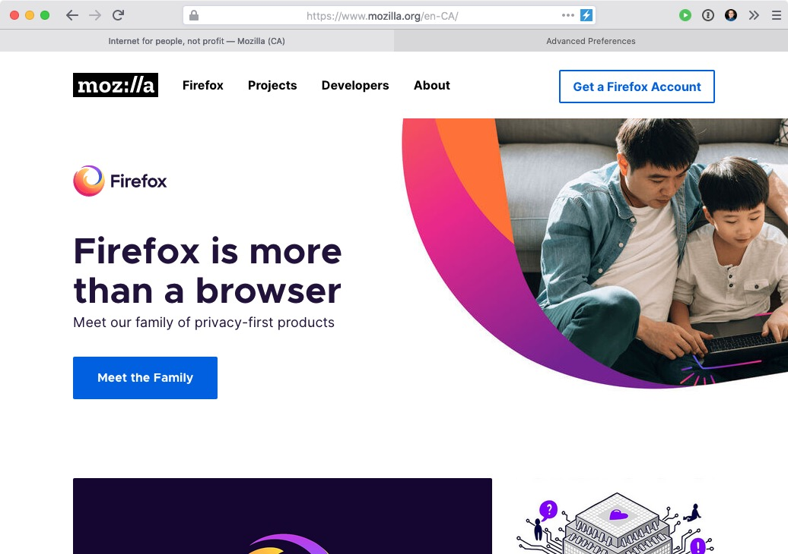

# Firefox Safari Clone

A few days ago I saw one post on [Reddit](https://www.reddit.com/r/FirefoxCSS/comments/fbg0bv/safariesque_for_firefox_73_on_macos/) showing some `userChrome.css` customizations to make Firefox to look like Safari. Decided to get their file and change a couple things. All credits to OP :)

## Installation

- The file `userChrome.css` should live in `~/Library/Application Support/Firefox/Profiles/<SOME PROFILE NAME>/chrome`

## Editing the file / inspecting the UI

- Go to `about:config`
- Search for `devtools.debugger.remote-enabled`
- Change value to `true`. This will enable the option Developer > Browser Toolbox
- Then you can follow this: [How to edit userChrome.css live](https://github.com/adamhotep/Firefox-Tweaks/wiki/How-to-edit-userChrome.css-live)

## Todo

Ideally, I would like to replicate Safari in Sketch or something like that to achieve pixel-perfection but I am not sure when I will do that ¯\\\_(ツ)_/¯

**PRs welcome :)**
